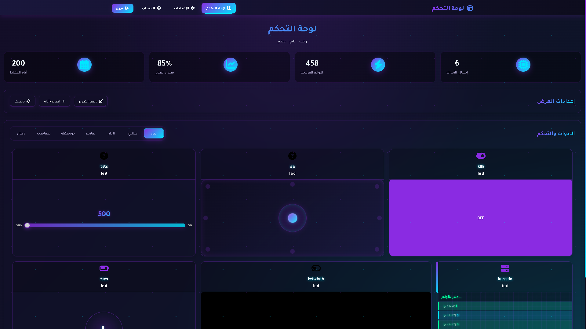
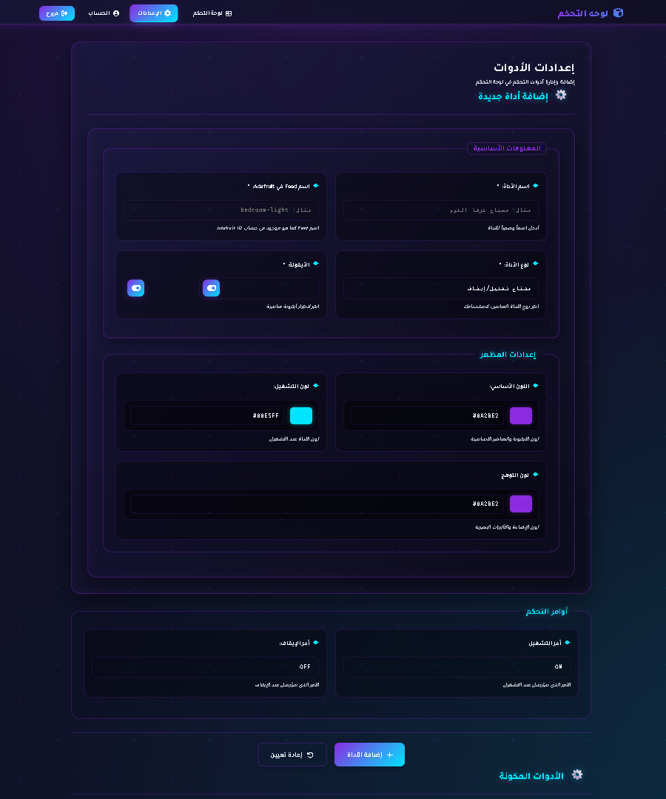
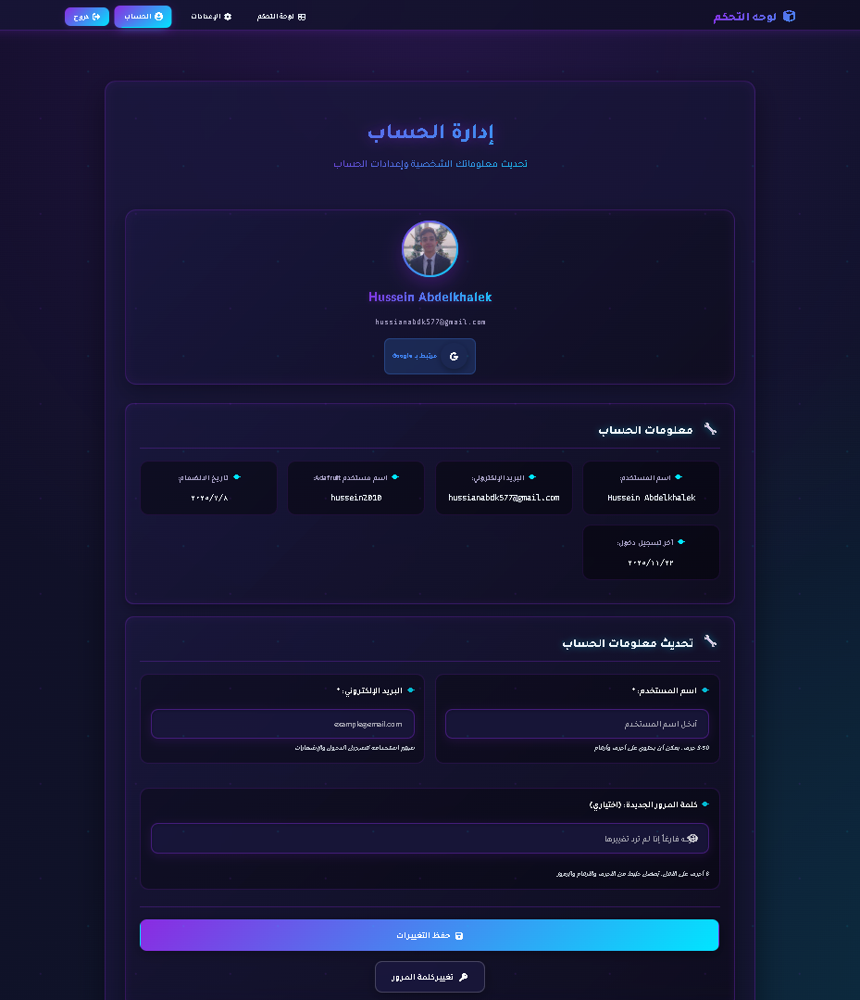
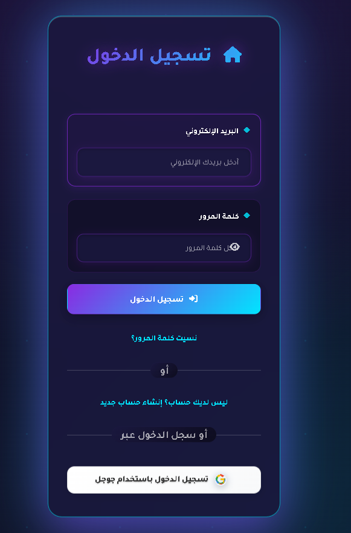

# ControlEx

[](https://male-cindy-controlex1-bd3de383.koyeb.app/)

**ControlEx** is a modern front-end project that showcases a collection of interactive UI controls and a responsive control panel ready to use, learn from, or extend for your own projects.

---

## 📸 Gallery

Take a look at the interface in action:

| **Interactive Dashboard** | **Smart Settings** |
|:-------------------------:|:------------------:|
|  |  |
| *Real-time control panel with sliders & toggles* | *Easy widget configuration & management* |

| **User Profile** | **Secure Authentication** |
|:----------------:|:-------------------------:|
|  |  |
| *Complete account management system* | *Modern login & security interface* |

---

## ⭐️ Key Features

- ✅ **Modern Design:** Attractive, Dark-themed UI with neon accents.
- ✅ **Responsive:** Fully responsive and mobile-friendly layout.
- ✅ **Pure Front-End:** Built with **Vanilla JavaScript**, **CSS**, and **HTML** - no heavy frameworks.
- ✅ **Production Ready:** Includes `server.js` for easy deployment on platforms like Koyeb/Render.
- ✅ **Clean Code:** Well-organized structure, easy to modify and extend.
- ✅ **Advanced Pages:** Dashboard, Settings, Account Management, and Authentication.

---

## 🔗 Live Demo

Check out the project in action:

👉 **[Live Demo: ControlEx App](https://male-cindy-controlex1-bd3de383.koyeb.app/)**

---

## 📂 Project Structure

```text
controlex/
├── assets/                # Images, icons, and global styles
├── screenshots/           # Project screenshots for README
├── index.html             # Home page
├── dashboard.html         # Dashboard/Control panel
├── account.html           # Account management
├── settings.html          # Settings page
├── reset-password.html    # Password reset
├── forgot-password.html   # Forgot password
├── offline.html           # Offline page
├── package.json           # Project configuration
├── server.js              # Static file server (for deployment)
└── README.md              # Project documentation
```

---

## 🚀 Getting Started

### 1️⃣ Prerequisites
- **Node.js** (Only required if you want to run the local server).
- A modern web browser.

### 2️⃣ Installation & Setup

**Option 1: Direct File Opening**
```bash
git clone [https://github.com/HusseinAbdelkhalek2010/controlex.git](https://github.com/HusseinAbdelkhalek2010/controlex.git)
cd controlex
# Simply open index.html in your browser
```

**Option 2: Run Local Server**
```bash
# Install dependencies
npm install

# Start the server
npm start
# or
node server.js

# Open http://localhost:3000 in your browser
```

---

## 📖 Usage

- **Explore the Interface:** Navigate through all pages and interactive elements.
- **Study the Code:** Examine how interactive components (sliders, toggles) are built using Pure JS.
- **Customize:** Modify colors in CSS variables to match your brand.
- **Reuse Components:** Copy parts of the dashboard widgets for your own IoT or Web projects.

---

## 🛠️ Technology Stack

| Technology | Percentage | Purpose |
| :--- | :--- | :--- |
| **JavaScript** | 46.6% | Logic & Interactivity (No Frameworks) |
| **CSS** | 37.6% | Responsive Design & Styling |
| **HTML** | 15.8% | Structure & Accessibility |

---

## 📄 Main Pages

- 🏠 **Home:** Landing page with overview.
- 📊 **Dashboard:** Main control panel with real-time widgets.
- 👤 **Account:** User profile and data management.
- ⚙️ **Settings:** Add/Remove widgets and configure API keys (e.g., Adafruit IO).
- 🔐 **Authentication:** Login, Register, and Password Recovery flows.

---

## 🤝 Contributing

We welcome all contributions and suggestions!

**How to contribute:**
- **Open an Issue:** Report bugs or suggest new features.
- **Fork & Pull Request:** Add new features or improvements.
- **Start Discussions:** Share ideas and improvements.

**Steps to Contribute:**
1. Fork the repository.
2. Create your feature branch (`git checkout -b feature/AmazingFeature`).
3. Commit your changes (`git commit -m 'Add some AmazingFeature'`).
4. Push to the branch (`git push origin feature/AmazingFeature`).
5. Open a Pull Request.

---

## 💡 Tips & Tricks

- **DevTools:** Use Browser DevTools (Press `F12`) to inspect the glowing UI elements.
- **Server:** Check `server.js` to see how to serve static files with Node.js without Express.
- **Theming:** Try modifying the CSS `:root` variables to change the entire color theme instantly.

---
## 👨‍💻 Project Information

- **Developer:** husseinabdelkhalek
- **Repository:** [GitHub Repository](https://github.com/husseinabdelkhalek/controlex-web)
- **Live Demo:** [Visit Live Site](https://male-cindy-controlex1-bd3de383.koyeb.app/)
- **License:** This project is licensed under the **MIT License**.

---

## 📞 Support & Contact

If you have questions or need help:
- [Open an Issue](https://github.com/husseinabdelkhalek/controlex-web/issues)
- Visit the [Live Demo](https://male-cindy-controlex1-bd3de383.koyeb.app/)

**⭐️ Show Your Support**

If you find **ControlEx** helpful or inspiring, please give it a star ⭐️!

Your support helps the project grow. Thank you! 🙏
